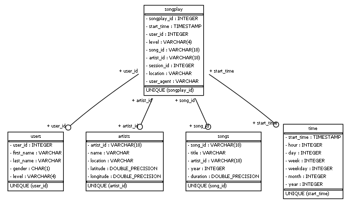

# Project 1: Data Modeling
In this project, We'll apply what we've learned on data modeling with Postgres and build an ETL pipeline using Python. To complete the project, We will need to define fact and dimension tables for a star schema for a particular analytic focus, and write an ETL pipeline that transfers data from files in two local directories into these tables in Postgres using Python and SQL.

# Schema for Song Play Analysis





## Fact tables
### songplay tables
Primary key: songplay_id
Foreign key: start_time, user_id, song_id, artist_id
| Column      | Type        | Nullable | Explanation                                                                                  |
| ----------- | ----------- | -------- | --------------------------------------------------------------------------------------------- |
| songplay_id | SERIAL      |          | In Log dataset, there are no songplay_id => songplay_id should auto increment (SERIAL)        |
| start_time  | TIMESTAMP   | not null | "registration" log dataset                                                                    |
| user_id     | INT         | not null | "userId" log datase                                                                           |
| level       | VARCHAR(4)  | not null | "level" log dataset                                                                           |
| song_id     | VARCHAR(18) | not null | "song"   log dataset =  "title" song dataset => query song_id (limit 18 characters)           |
| artist_id   | VARCHAR(18) | not null | "artist"  log dataset =  "artist_name" song data set => query artist_id (limit 18 characters) |
| session_id  | INT         | not null | "sessionId" log dataset                                                                       |
| location    | VARCHAR     | not null | "location" log dataset                                                                        |
| user_agent  | VARCHAR     | not null | "userAgent" log dataset                                                                       |

## Dimension tables

### users tables
Primary key: user_id
| Column     | Type       | Nullable | Explanation            |
| ---------- | ---------- | -------- | ----------------------- |
| user_id    | INT        | not null | "userId" log datase     |
| first_name | VARCHAR    | not null | "firstName" log dataset |
| last_name  | VARCHAR    | not null | "lastName" log dataset  |
| gender     | CHAR(1)    | not null | "gender" log dataset    |
| level      | VARCHAR(4) | not null | "level" log dataset     |

### songs tables
Primary key: song_id
| Column    | Type        | Nullable | Explanation                                 |
| --------- | ----------- | -------- | -------------------------------------------- |
| song_id   | VARCHAR(18) | not null | "song_id" song dataset (limit 18 characters) |
| title     | VARCHAR     | not null | "title" song dataset                         |
| artist_id | VARCHAR(18) | not null | "artist_id" song dataset                     |
| year      | INT         | not null | "year" song dataset                          |
| duration  | FLOAT       | not null | "duration" song dataset                      |

### artists tables
Primary key: artist_id
| Column     | Type        | Nullable | Explanation                                   |
| ---------- | ----------- | -------- | ---------------------------------------------- |
| artist_id  | VARCHAR(18) | not null | "artist_id" song dataset (limit 18 characters) |
| name       | VARCHAR     | not null | "artist_name" song dataset                     |
| location   | VARCHAR     |          | "artist_location" song dataset                 |
| latitude   | FLOAT       |          | "artist_latitude" song dataset                 |
| longtitude | FLOAT       |          | "artist_longtitute" song dataset               |

### time tables
Primary key: start_time
| Column     | Type      | Nullable | Explanation                                                 |
| ---------- | --------- | -------- | ------------------------------------------------------------ |
| start_time | TIMESTAMP | not null | "ts" log dataset                                             |
| hour       | INT       | not null | break down from start_time                                   |
| day        | INT       |          | break down from start_time                                   |
| week       | INT       |          | break down from start_time                                   |
| month      | INT       |          | break down from start_time                                   |
| year       | INT       |          | break down from start_time                                   |
| weekday    | INT       |          | break down from start_time (0 Monday, 1 Tuesday, … 6 Sunday) |

# Explanation of the files in the repository
1. ```create_tables.py```: drops and creates our tables. We run this file to reset our tables before each time we run our ETL scripts.
2. ```sql_queries.py```: contains all our sql queries, and is imported into the last three files above.
3. ```etl.ipynb```: reads and processes a single file from song_data and log_data and loads the data into our tables. This notebook contains detailed instructions on the ETL process for each of the tables.
4. ```etl.py```: reads and processes files from song_data and log_data and loads them into our tables. We can fill this out based on our work in the ETL notebook.
5. ```test.ipynb```: displays the first few rows of each table to let us check our database.
6. ```README.md```: provides discussion on our project.
7. ```er_diagrams.py```: to generate ER diagram

# Environment set up (In case run locally)
1. Set up python, postgresSQL
2. Install psycopg2: ```pip install psycopg2```
3. Install pandas: ```pip install pandas```
4. Install ipython-sql to run test.ipynb locally: ```pip install ipython-sql```
5. install sqlalchemy_schemadisplay(to create ER diagrams): ```pip install sqlalchemy_schemadisplay```
6. install graphviz (In case run locally) https://graphviz.org/download/
7. Open postgres, create sparkifydb database and student user
- create sparkifydb: ```create database sparkifydb;```
- create user student:  ```create user student with password 'student';```
- grant permission: ```grant all on database sparkifydb to student;```
- set owner sparkifydb: ```alter database sparkifydb owner to student;```
- set create db permission: ```alter user student with createdb;```

# Run scripts

1. ```python create_tables.py```
2. ```python etl.py``` or run manually ```etl.ipynb``` file

