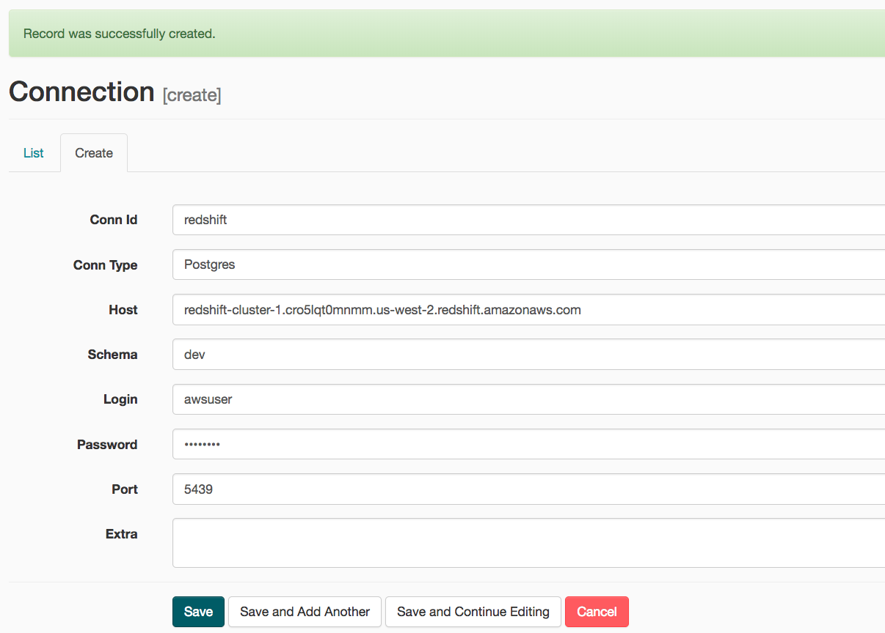

# Project 5: DATA PIPELINE
This project will introduce you to the core concepts of Apache Airflow. To complete the project, you will need to create your own custom operators to perform tasks such as staging the data, filling the data warehouse, and running checks on the data as the final step.

We have provided you with a project template that takes care of all the imports and provides four empty operators that need to be implemented into functional pieces of a data pipeline. The template also contains a set of tasks that need to be linked to achieve a coherent and sensible data flow within the pipeline.

You'll be provided with a helpers class that contains all the SQL transformations. Thus, you won't need to write the ETL yourselves, but you'll need to execute it with your custom operators.

# Explanation of the files in the repository
1. ```./redshift_helper/create_cluster.py```: base on value from dwh.cfg to create aws redshift cluster
2. ```./redshift_helper/delete_cluster.py```: base on value from dwh.cfg to delete aws redshift cluster
3. ```./airflow/dags/create_tables.sql```: To store SQL command in order to create table on Redshift cluster
4. ```./airflow/dags/udac_example_dag.py```: dags file in order to design data pipeline
5. ```./airflow/plugins/helpers/sql_queries.py```: store sql command in order to insert data to table
6. ```./airflow/plugins/operators/data_quality.py```: define data quality operator in order to be used in dags file
7. ```./airflow/plugins/operators/load_dimension.py```: define load dimension table operator in order to be used in dags file
8. ```./airflow/plugins/operators/load_fact.py```: define load fact table operator in order to be used in dags file
9. ```./airflow/plugins/operators/stage_redshift.py```: define load s3 to redshift operator in order to be used in dags file
10. ```README.md```: provides discussion on our project.
11. ```dwh_p.cfg```: to store all configurations of this project

# Prerequisites

1. Create/use IAM user with attach policy ```AdministratorAccess```, ```AmazonRedshiftFullAccess```, ```AmazonS3FullAccess```
2. Modify that Aws_access_key and aws_secret_key to ```dwh_p.cfg``` file
3. Run ```python redshift_helper/create_cluster.py``` to create Redshift cluster (~ 3 mins wait)
4. In  ```dwh_p.cfg``` file will autofill redshift cluster host name: (or capture host name from log):


5. Start airflow UI: ```/opt/airflow/start.sh``` then click ```Access Airflow``` button
6. Add redshift to airflow: 
    <details><summary>Click to see</summary>
    <p>
        
    1. Click on the ```Admin``` tab and select ```Connections.```. Select ```Create```
    2. On the create connection page, enter the following values:
         - Conn Id: Enter redshift.
         - Conn Type: Enter Postgres.
         - Host: Enter the endpoint of your Redshift cluster, excluding the port and schema name at the end. You can find this by selecting your cluster in the Clusters page of the Amazon Redshift console. See where this is located in the screenshot below. IMPORTANT: Make sure to NOT include the port and schema name at the end of the Redshift endpoint string.
         - Schema: Enter dev. This is the Redshift database you want to connect to
         - Login: Enter dwhuser (from [CLUSTER].db_user in ```dwh_p.cfg`` file).
         - Password: Enter the password you created when launching your Redshift cluster. (from [CLUSTER].db_password in ```dwh_p.cfg`` file).
         - Port: Enter 5439. Once you've entered these values, select Save. (from [CLUSTER].db_port in ```dwh_p.cfg`` file).
    
   
    </p>
    </details>

7. Add aws to airflow: 

    <details><summary>Click to see</summary>
    <p>
                
        1. Click on the ```Admin``` tab and select ```Connections.```. Select ```Create```
        2. On the create connection page, enter the following values:
            - Conn Id: Enter aws_credentials.
            - Conn Type: Enter Amazon Web Services.
            - Login: Enter your Access key ID from the IAM User credentials you downloaded earlier.
            - Password: Enter your Secret access key from the IAM User credentials you downloaded earlier. Once you've entered these values, select Save.

    </p>
    </details>

# Run scripts

1. Access AirFlow UI
2. On AirFlow UI, run ```udac_example_dag```  
3. After running successfully, run delete cluster Run ```python redshift_helper/delete_cluster.py``` (~ 3 mins wait)

 


